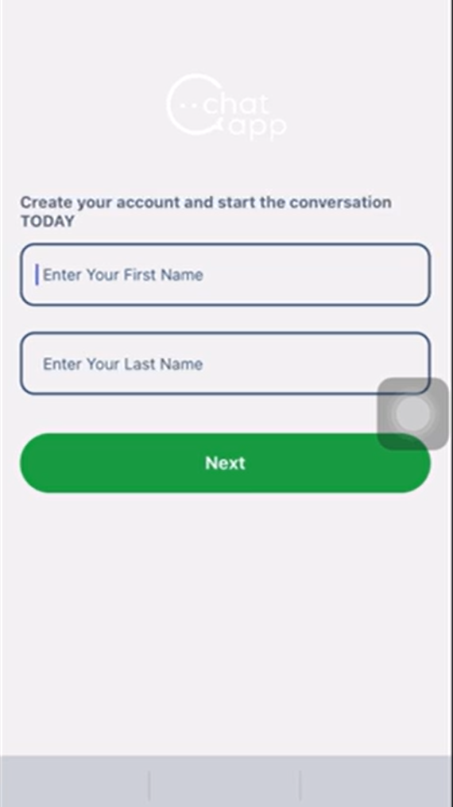
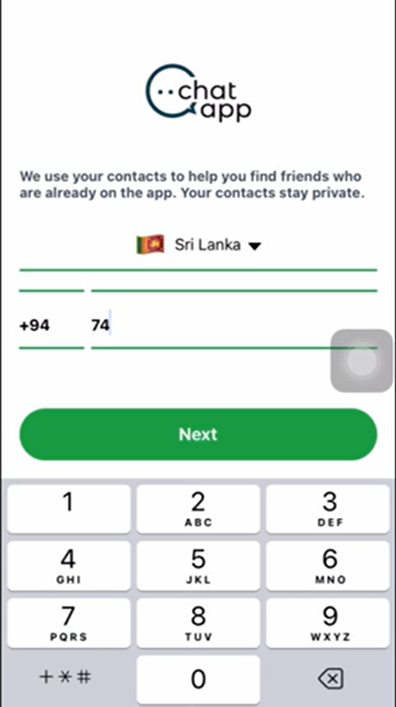
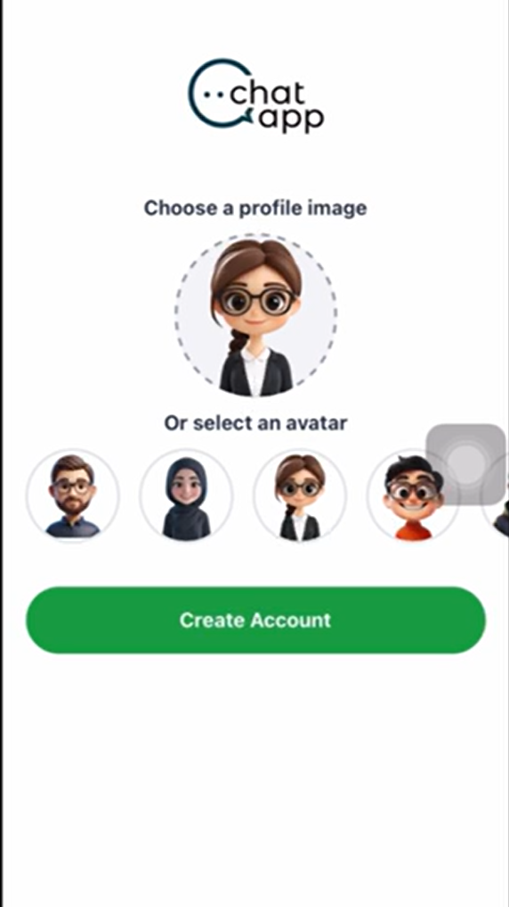
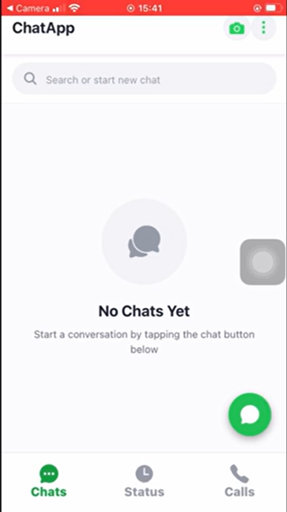
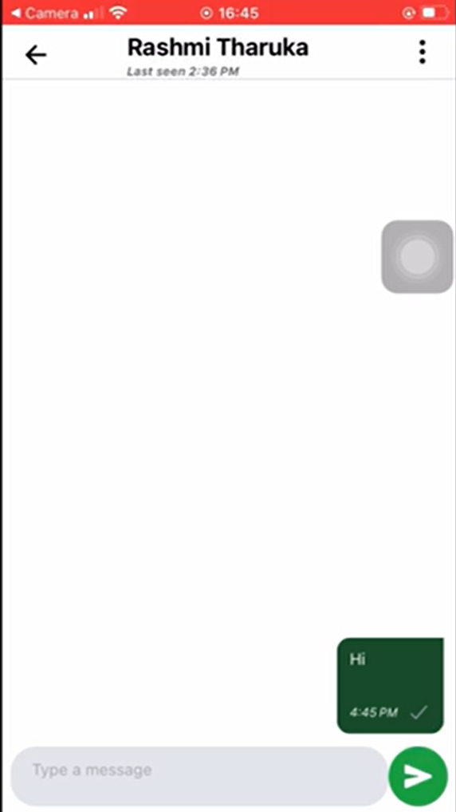
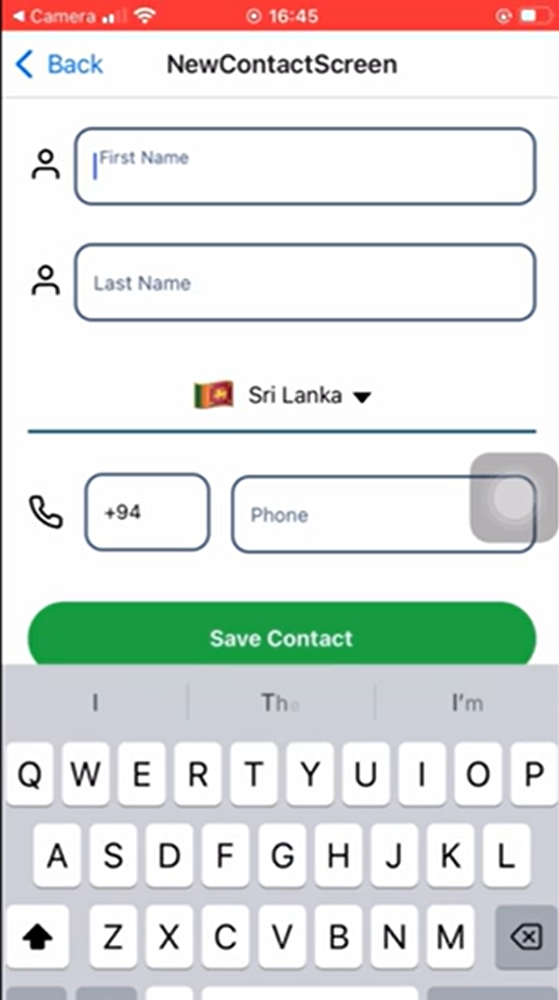
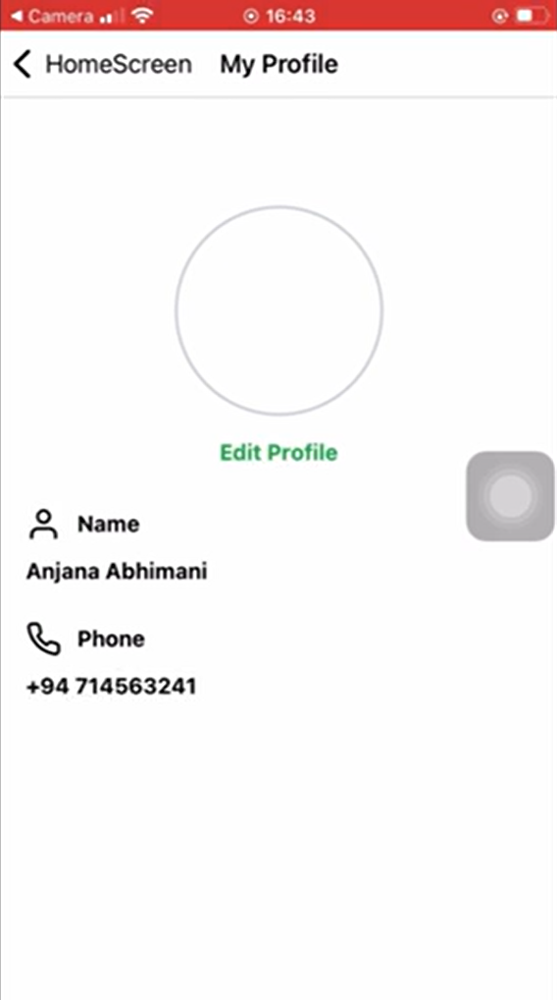
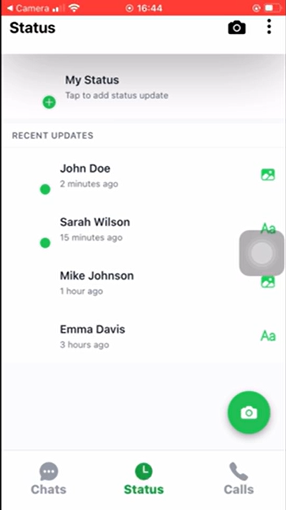
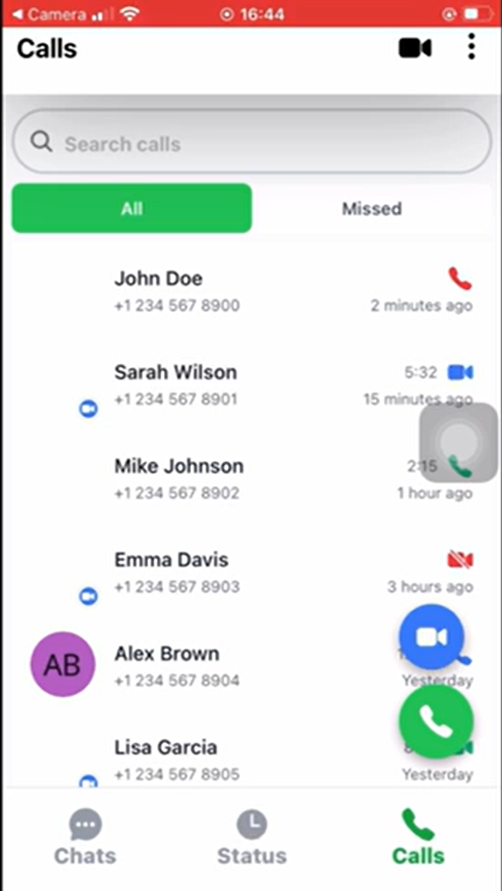

# Real-Time Chat Application

A modern real-time chat application built using React Native for the frontend and Java Servlets with Hibernate for the backend. The application enables users to communicate instantly through secure and scalable WebSocket-based messaging.

## 📌 Project Overview

This project is a full-stack real-time chat system designed to provide fast and reliable communication between users. It integrates modern mobile frontend technologies with a robust backend architecture to support instant messaging, user authentication, and multimedia sharing.

The application focuses on real-time data synchronization, responsive design, and secure user management while supporting cross-platform mobile environments.

## 🚀 Key Features

• Real-Time Messaging – Instant bidirectional messaging using WebSocket technology.

• Secure Authentication – User login and registration with secure session handling.

• Full-Stack Architecture – React Native mobile frontend with Java Servlet and Hibernate backend.

• Chat Interface – Modern chat UI with conversation list and custom chat bubbles.

• Profile Management – Users can update profile images and display names.

• Online Status Tracking – Displays real-time user online/offline status.

• Multimedia Messaging – Supports sending images, videos, emojis, and voice notes.

• Cross-Platform Support – Compatible with Android and iOS devices.

## 🛠️ Technologies Used

Frontend
- React Native
- JavaScript
- CSS

Backend
- Java Servlets
- Hibernate ORM
- WebSocket API

Database
- MySQL

Tools
- Git & GitHub
- Android Studio
- VS Code

## 📷 Application Screenshots

### Login Screen

### Login Verification

### Login Success

### Chat List

### Chat Window

### Add New Contact

### Profile Page

### User Status

### Voice / Call Feature

## ⚙️ Installation

1. Clone the repository
git clone https://github.com/rashmitharuka2004-hash/react-realtime-chat-app.git

2. Navigate to the project folder
cd react-realtime-chat-app

3. Install dependencies
npm install

4. Run the project
npm start

## Author

Rashmi Tharuka  
Software Engineering Undergraduate  
